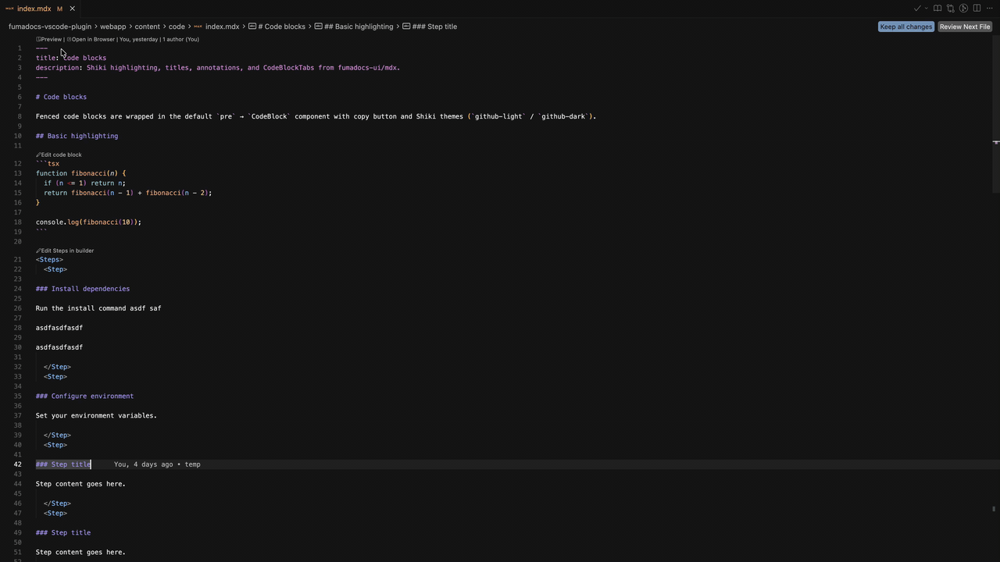
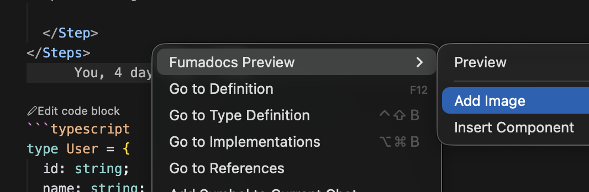
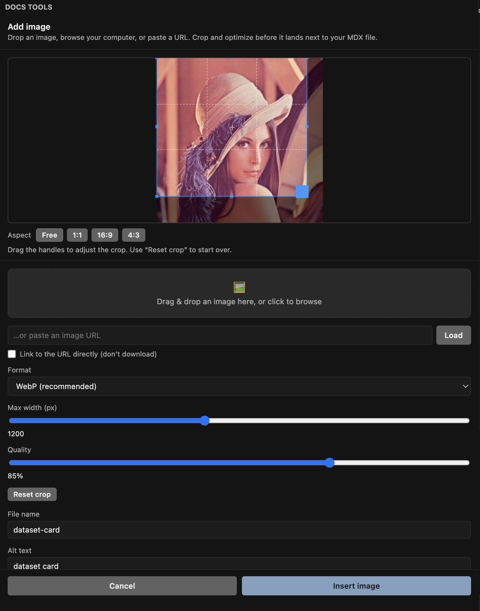
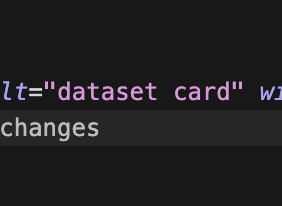
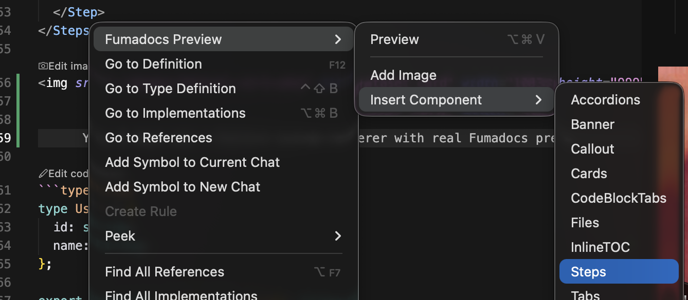
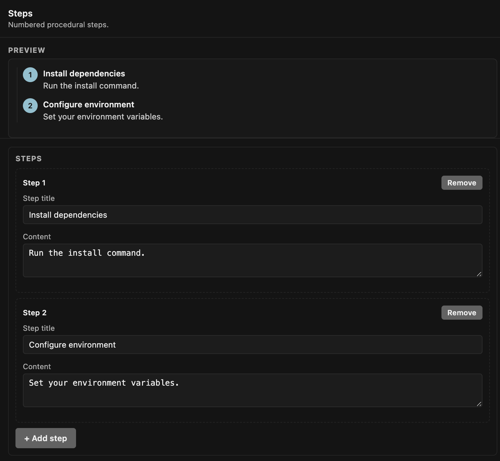

# Fumadocs Preview Editor

Built on and for [Fumadocs](https://www.fumadocs.dev/). Designed to help non-technical teams create, preview, and manage Fumadocs content from VSCode without opening a terminal.

[](https://marketplace.visualstudio.com/items?itemName=ResearchAndDesire.fumadocs-vscode-plugin)
[](https://open-vsx.org/extension/researchanddesire/fumadocs-vscode-plugin)



## Why This Exists

Fumadocs is excellent for technical documentation, but many docs teams include writers, editors, product folks, and support teammates who should not need to manage dependencies or hand-author every MDX component.

This extension packages a full Fumadocs preview experience inside VSCode. Open any Markdown or MDX file, launch the preview, and the extension detects the active content root automatically. If your workspace has multiple content roots, it switches as you move between files.

## Features

- Runs a real Fumadocs preview inside VSCode or in your browser.
- Detects the nearest Fumadocs content root from the active MDX/Markdown file.
- Manages the preview app dependencies for the user.
- Live-reloads as you type, save, and move around docs files.
- Adds CodeLens actions for editing supported images and components in visual builders.
- Includes image cropping, resizing, compression, width/height management, and local original-image caching.
- Provides builders for common Fumadocs UI patterns, including steps, cards, tabs, accordions, callouts, files, banners, code blocks, and tables.
- Supports multiple content roots in the same workspace.

## Image Editing

Images can be inserted or edited visually. The image builder lets editors crop, resize, compress, choose output format and quality, and keep `width`/`height` attributes in sync for MDX image tags.





When an image is managed by the builder, the original source is cached locally so editors can come back later and change the crop, max width, format, or quality without repeatedly compressing an already-compressed file.

Existing image tags get an **Edit image** CodeLens directly in MDX:



## Component Builders

Common Fumadocs components can also be created and edited from visual builders. The goal is to keep the MDX source clean while giving non-technical teammates a form-driven editing experience.

For example, the Steps builder can generate and update a Fumadocs `<Steps>` block:





## Quick Start

1. Install the extension from the [VS Code Marketplace](https://marketplace.visualstudio.com/items?itemName=ResearchAndDesire.fumadocs-vscode-plugin) or [Open VSX](https://open-vsx.org/extension/researchanddesire/fumadocs-vscode-plugin).
2. Open an `.mdx` or `.md` file inside a Fumadocs content directory.
3. Run **Fumadocs: Preview** with `Cmd+Alt+V` / `Ctrl+Alt+V`, or click the preview CodeLens at the top of the file.
4. Use the Docs Tools sidebar to insert images and common components, or click CodeLens actions in the editor to modify existing content.

## Image Requirements

This extension inserts and edits images as standard Markdown (``) and `` references. For those images to render with proper `width` and `height` in production, your Fumadocs project should have the [`remark-image`](https://www.fumadocs.dev/docs/headless/mdx/remark-image) plugin configured.

`remark-image` is included by default in Fumadocs MDX, so most projects already have it. If you use a headless or `fumadocs-core` setup, add it to your MDX remark plugins:

```ts
import { remarkImage } from 'fumadocs-core/mdx-plugins';

export default {
  remarkPlugins: [remarkImage],
};
```

See the [remark-image docs](https://www.fumadocs.dev/docs/headless/mdx/remark-image) for options. The live preview in this extension enables `remark-image` automatically, so previews match production behavior.

## Install

- [VS Code Marketplace](https://marketplace.visualstudio.com/items?itemName=ResearchAndDesire.fumadocs-vscode-plugin)
- [Open VSX](https://open-vsx.org/extension/researchanddesire/fumadocs-vscode-plugin)
- [GitHub](https://github.com/researchanddesire/fumadocs-vscode-plugin)

## License

MIT — free to use, modify, and distribute.
