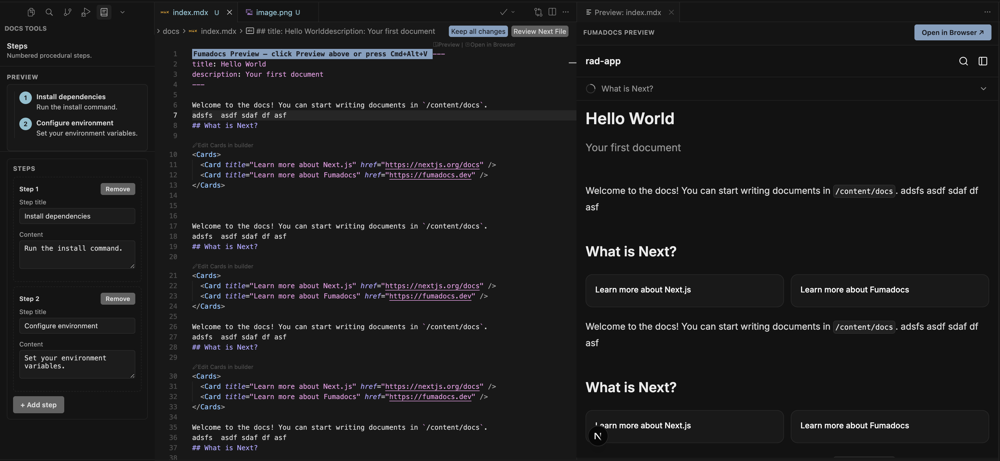

# Fumadocs Preview Editor

Built on and for [Fumadocs](https://www.fumadocs.dev/). Designed to help non-technical teams create and manage basic Fumadocs content — without ever touching the command line.

## Features

- Renders a real Fumadocs site live in the editor or your browser
- Live-reloads as you type and save
- Edit components in a UI editor with a live preview
- No need for developers to install or manage dependencies
- Supports multiple content roots, switched dynamically as you move between files

## Quick start

1. Open an `.mdx` or `.md` file.
2. Run **Fumadocs: Preview** (`Cmd+Alt+V` / `Ctrl+Alt+V`, or the link at the top of the file).
3. Edit your content and watch the preview reload.

## Install

- [VS Code Marketplace](https://marketplace.visualstudio.com/items?itemName=ResearchAndDesire.fumadocs-vscode-plugin)
- [Open VSX](https://open-vsx.org/extension/researchanddesire/fumadocs-vscode-plugin)

## License

MIT — free to use, modify, and distribute.
